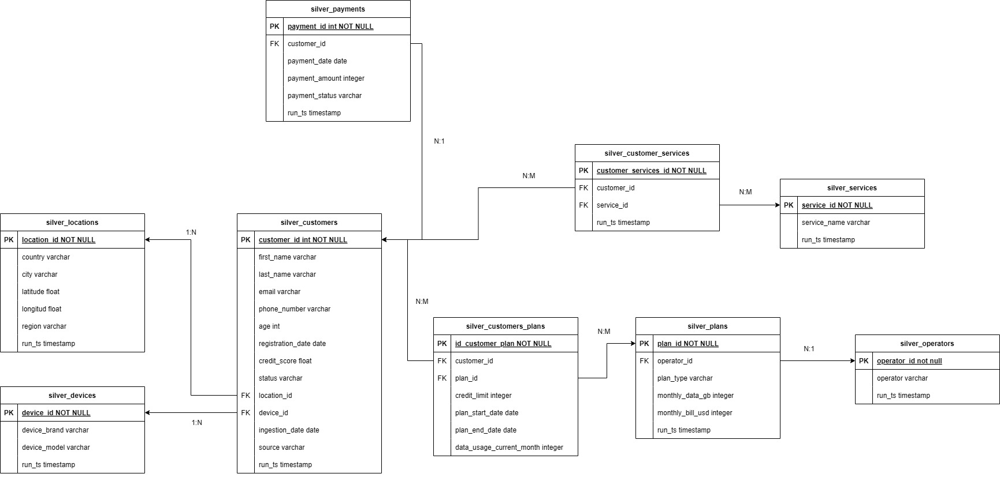

# Qveristy Data Final Project 2025 Pipeline

An end-to-end (E2E) data pipeline that ingests raw JSON from S3, lands it in
Postgres (Bronze), builds **Silver** models, promotes them to a curated **Gold**
star-schema with dbt, and finally surfaces business insights/dashboards.

| Layer  | Tooling                | Purpose                                                  |
| ------ | ---------------------- | -------------------------------------------------------- |
| Raw    | S3                     | Immutable dumps of source files                          |
| Bronze | Python + Airflow       | JSON → Postgres table with no validation                 |
| Silver | dbt (`dbt_run_silver`) | Cleans, dedupes, normalises – produces `silver_*` models |
| Gold   | dbt (`dbt_run_gold`)   | Star-schema facts & dims – drives analytics + dashboards |

---

## 📊 Insights Uncovered

| Nº  | Insight de negocio (síntesis)                                                                                                                                      |
| --- | ------------------------------------------------------------------------------------------------------------------------------------------------------------------ |
| 1   | **ARPU por tipo de plan**: los usuarios pospago generan el ARPU más alto (~ US$ 60), solo 3 US$ por encima de prepago/control ⇒ limitada diferenciación de precio. |
| 2   | **Ingresos por país**: México es el mayor contribuyente; Perú, Colombia, Chile y Argentina siguen muy de cerca.                                                    |
| 3   | **Ingresos por segmento crediticio**: los clientes con crédito _Poor_ aportan la mayor parte del ingreso ⇒ necesidad de reforzar control de riesgo.                |
| 4   | **Distribución de clientes por país**: base equilibrada; México lidera con ~ 820 clientes.                                                                         |
| 5   | **Edad × plan**: 20‑70 años concentran la base; Control atrae mayores, Prepago a jóvenes.                                                                          |
| 6   | **Edad × país × operador**: Claro y Tigo dominan 20‑60 años; WOM destaca en mayores en Chile/Argentina.                                                            |
| 7   | **Cuota por operador**: Claro y Tigo 26 %, WOM 25 %, Movistar 23 ⇒ mercado muy competitivo.                                                                        |
| 8   | **Segmentación por score**: 45 % de los clientes están en _Poor_; potencial de upsell si mejoran su score.                                                         |
| 9   | **Marcas de dispositivo**: Lideran Apple y Samsung, con Xiaomi casi igual; mantener paridad iOS/Android.                                                           |
| 10  | **Marca × país × operador**: México‑Tigo‑Apple y México‑Claro‑Samsung son los combos más frecuentes; orientar campañas de upgrade.                                 |
| 11  | **Marca × tipo de plan**: Pos‑pago se asocia a Apple; Prepago a Xiaomi; ajustar bundles dispositivo‑plan.                                                          |
| 12  | **Servicios más contratados**: Roaming e Internacional superan incluso a datos; vender roaming al alta.                                                            |
| 13  | **Combinaciones de servicios**: preferencia por un único Roaming o paquete _quad‑play_ completo; promover bundles integrales.                                      |
| 14  | **Problemas de pago**: ~ 9 % de clientes con incidencias; dunning proactivo necesario.                                                                             |
| 15  | **Saldos pendientes**: 2 758 clientes adeudan ⇒ impulsar auto‑pago y alertas.                                                                                      |
| 16  | **Score vs pago**: correlación ≈ 0; modelos de riesgo necesitan variables adicionales.                                                                             |
| 17  | **Nuevas altas**: 100‑130 altas/mes, picos dic‑ene y jul; alinear campañas.                                                                                        |
| 18  | **Altas por operador**: Tigo crece desde 2024 y WOM acelera; Claro podría perder share.                                                                            |
| 19  | **Estado de la base**: 33 % activos, 34 % suspendidos, 33 % inactivos; fricción alta en suspensiones.                                                              |
| 20  | **Ingresos por plan × operador**: Pos‑pago WOM es el más rentable (61 US$); Pre‑pago Claro el menos; WOM monetiza mejor en todos los planes.                       |

> ℹ️ Para obtener estos insights de negocio, en la carpeta [`/analysis`](./analysis) encontrarás un conjunto de queries SQL, uno por cada pregunta planteada, que operan exclusivamente sobre las tablas **gold**.  
> Cada consulta responde directamente a un KPI o métrica relevante para el negocio, utilizando hechos y dimensiones ya depurados y enriquecidos.

---

## 👤 Participant

- **Name**: Franco Buenahora
- **Email**: buenahorafranco@gmail.com

---

## 🚀 Quick Start

> **Prereqs:** Docker ≥ 24, docker-compose, 4 GB RAM free.

```bash
# clone & bring services up
git clone https://github.com/buenahora/qversity-data-2025-montevideo-francobuenahora.git
cd qversity-data-2025-montevideo-francobuenahora

# airflow + postgres + dbt
docker compose up -d

# open the Airflow UI → http://localhost:8080 (admin / admin)
# open dbt Docs (once generated) → http://localhost:8081
```

---

## 🏃‍♂️ Run the Pipeline

| Step                   | What it does                        | How to run                                 |
| ---------------------- | ----------------------------------- | ------------------------------------------ |
| **1. Trigger E2E DAG** | Orchestrates Bronze → Silver → Gold | docker compose exec -it airflow bash       |
|                        |                                     | airflow dags trigger e2e_pipeline_dag      |
| **2. Monitor**         | Watch task-level progress           | Airflow UI → _DAGs_ → **e2e_pipeline_dag** |
| **3. Inspect data**    | Explore tables                      | `psql`, dbt Docs, or any SQL IDE           |

---

## ✅ Run Tests Manually

```bash
# runs both silver & gold test suites
docker compose exec dbt dbt test
```

- All **schema tests** live in `models/**/schema.yml`
- Unit-style assertions live in `tests/`

---

## 📚 Generate & Serve dbt Docs

```bash
# compiles docs + lineage
docker compose exec dbt dbt docs generate

 # serves at http://localhost:8081
docker compose exec dbt dbt docs serve --port 8080 --host 0.0.0.0
```

#### 🖼️ Static ERD

A static version of the ERD is included below for quick reference:


